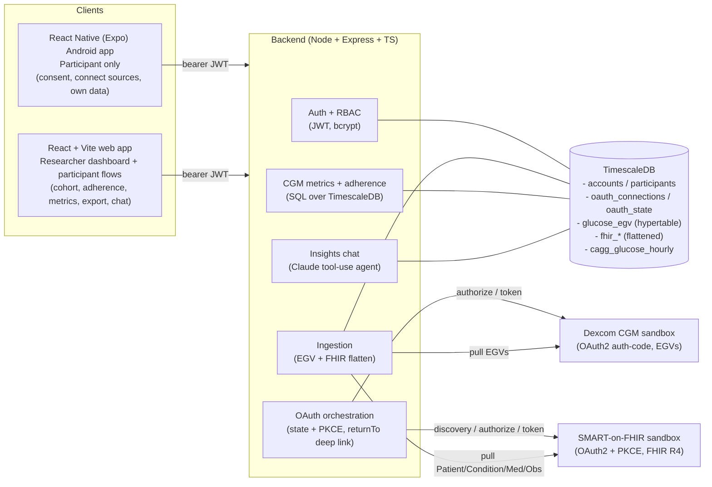
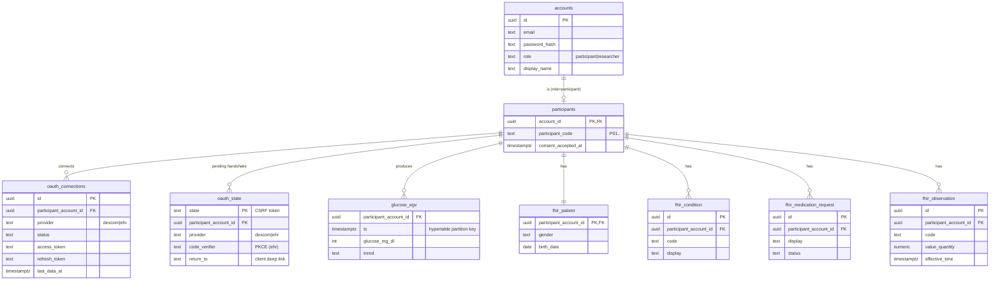

# StudySync — Design & Decisions

A scaled-down wearable data platform: participants connect two real health-data sources over
OAuth 2.0 (Dexcom CGM + EHR via SMART-on-FHIR); researchers monitor the cohort, view device-wear
adherence, export data, and ask natural-language questions over both sources.

Two clients share one API: a **React Native (Expo) Android app** for participants (sign-in,
consent, connect/disconnect sources, view own data) and a **React web app** for researchers (the
dashboard) that also retains the original participant flows. The Android app is participant-only —
it rejects researcher logins and points them to the web dashboard.

## 1. Architecture

Both clients hit the same API with a bearer JWT and differ only in role: the Android app blocks
non-participants, the web app serves researchers (and the original participant views). The OAuth
callback redirects to a `returnTo` deep link (`studysync://oauth` / Expo dev URL) for the mobile
client, or to the web participant page for the browser — the same handshake serves both.

**Flow of a data-source connection (genuine OAuth, no passwords in our app):**

1. Participant clicks *Connect EHR* → backend reads the SMART discovery doc, generates `state`
   + a PKCE verifier/challenge, persists them in `oauth_state`, returns the provider authorize URL.
2. Browser is handed off to the provider; participant authenticates **to the provider** and (in
   the sandbox) picks a simulated patient.
3. Provider redirects to our `/api/connect/ehr/callback?code&state`. We look up `state`, exchange
   the code (+ PKCE verifier) for an access token, pull and flatten the clinical record, and store
   the live tokens in `oauth_connections`.

The `state` row carries the participant binding, so the callback works even though it has no
session cookie. Dexcom is the same shape minus PKCE (confidential client with a secret).

## 2. Data model (ER)

Everything joins on the participant: the CGM time-series (`glucose_egv`) and the flattened FHIR
tables all key on `participant_account_id`, which is the `participants.account_id`. This is the
join that lets the insights chat reason across glucose **and** the clinical record for one person.

### Why these shapes
- **`glucose_egv` is a TimescaleDB hypertable** partitioned on `ts` — the only high-cardinality,
  high-frequency table (≈12 readings/hour/participant). Hypertable chunking keeps time-range scans
  and the continuous aggregate efficient.
- **FHIR is flattened, not stored raw-only.** We keep the raw resource in a `jsonb` column for
  fidelity, but lift the fields researchers actually query (codes, values, dates) into typed
  columns so the dashboard and chat can use plain SQL without JSON gymnastics. This is the spirit
  of SQL-on-FHIR.

## 3. Adherence definition (decided explicitly)

A Dexcom sensor yields ~12 readings/hour (one per 5 min) when worn. We define:
- **Worn hour**: a clock-hour with **≥ 6 readings** (≥ 50% of expected).
- **Daily wear-hours**: count of worn hours in a day (0–24).
- **Adherence %** over a window: worn hours ÷ (24 × days).
- **Non-adherence alert**: < 70% wear over the last 7 days (for Dexcom-connected participants).

Wear-hours are computed from a **continuous aggregate** (`cagg_glucose_hourly`) that maintains
hourly reading counts incrementally, so the dashboard reads pre-aggregated rows instead of scanning
raw readings — aggregation lives in the database layer, per the brief.

## 4. CGM metrics

Implemented per the international Time-in-Range consensus (Battelino et al., *Diabetes Care* 2019),
computed in SQL over the hypertable: time-in-range (70–180), time-below (70/54), time-above
(180/250), mean glucose, **GMI** (3.31 + 0.02392 × mean), **%CV** (SD/mean), and the **ambulatory
glucose profile** (per-hour percentile curve via `percentile_cont`).

## 5. Key decisions — what we built, cut, and why

| Decision | Rationale |
|---|---|
| **Ship the web slice first, then the React Native Android app** | The MVP landed as a web app to prove a genuine end-to-end slice (real OAuth, TimescaleDB, RBAC) fast; the **React Native (Expo) Android participant app** was then built on top of the same API. Web-first de-risked the integrations before adding a second client. |
| **Mobile = participants, web = researchers** | The Android app is participant-only and rejects researcher logins in the auth layer (no session is ever created for a researcher). Researchers stay on the web dashboard, which needs the larger screen for cohort tables, charts, and the chat. The clients share one API and auth model, differing only by role. |
| **OAuth `returnTo` deep link with a poll fallback** | The OAuth callback redirects to a client-supplied `returnTo` (stored on the `oauth_state` row) — a `studysync://`/Expo deep link for mobile, the web participant page for the browser — so the in-app browser closes itself and hands back to the app. If an older backend ignores it, the app falls back to polling connection status, so the flow degrades gracefully. |
| **Consent state returned on login, not just `/me`** | A shared `userPayload()` helper hydrates `participantCode` + `consentAcceptedAt` for `/login`, `/register`, and `/me`, so a returning participant skips the one-time consent screen instead of being re-prompted every sign-in. |
| **Both integrations are genuine and verified end-to-end** | SMART-on-FHIR (public sandbox, no registration) and Dexcom CGM (registered sandbox app) both run the real OAuth handshake and pull live sandbox data: a real FHIR R4 clinical record and ~51k real EGV readings respectively. SMART needed a launch-context fix (encoding a provider-standalone context into the launcher's `/sim/` segment); Dexcom needed only a clean pass through its consent SPA. No mocked data in the running system. |
| **Anchor analytics windows to the latest reading** | The Dexcom sandbox serves a *fixed historical* window (e.g. ending months before "today"), so a literal "last 30 days from now" would be empty. Metrics, adherence, and AGP windows anchor to each participant's most recent reading, so they always reflect the real series. The cohort view still reports the absolute last-data timestamp so staleness is visible. |
| **TypeScript everywhere (Node + React)** | One language across the stack; fast to build; Express keeps the OAuth orchestration explicit and readable. |
| **Managed TimescaleDB (Timescale Cloud)** | Avoids local Docker; the same instance doubles as the hosted DB for the live deployment. |
| **Bearer-token auth (JWT in localStorage)** | Keeps OAuth callbacks simple cross-origin — the `oauth_state` row carries the participant binding, so callbacks don't depend on cookies/CORS. (A cookie/session swap is a known hardening step.) |
| **Continuous aggregate for adherence** | Pushes aggregation into TimescaleDB as the brief asks, instead of recomputing wear-hours in app code. |
| **Synthetic-glucose dev seeder (now unused, retained as a dev aid)** | Used only while Dexcom credentials were pending, to build the charts. Rows were tagged `source='synthetic-dev'` and have since been purged (`npm run clear-mock`); the running system contains only `source='dexcom'` data. The seeder remains in the repo as a local dev aid for anyone without sandbox credentials. |
| **Insights chat = Claude tool-use agent over read-only SQL** | Built last, behind the backbone. Rather than free-form SQL generation, the assistant (`claude-opus-4-8`, adaptive thinking) is given a fixed set of **read-only, parameterized data tools** (cohort, glucose metrics/ranking, AGP, adherence, find-condition, find-medication, labs, demographics) plus an `emit_chart` tool. A manual agentic loop runs the tools and feeds results back until Claude has a grounded answer; the frontend renders any emitted chart specs. This keeps answers grounded in real data (no hallucinated numbers), needs no schema knowledge from the researcher, and confines the model to safe queries. One conversational surface spans both sources because every tool keys on the participant. |

## 6. Known gaps / next steps

- Android app runs via Expo Go / a dev build; a signed release build (`eas build -p android`) and
  app-store packaging are not done. The custom `studysync://` scheme activates in a standalone
  build (in Expo Go the deep link uses the `exp://` dev URL).
- FHIR Blood-Pressure observations arrive as `component` values (systolic/diastolic) rather than a
  top-level `valueQuantity`, so they flatten with an empty value; splitting components is a small
  follow-up.
- Token **refresh on expiry** helpers exist for both providers but are not yet on a background
  scheduler; current ingest happens at connect time. A periodic re-sync job is the next step.
- Cookie/session auth + CSRF hardening; secrets-at-rest encryption for stored OAuth tokens.
- Per-study authorization scoping (currently all researchers see the single cohort).
